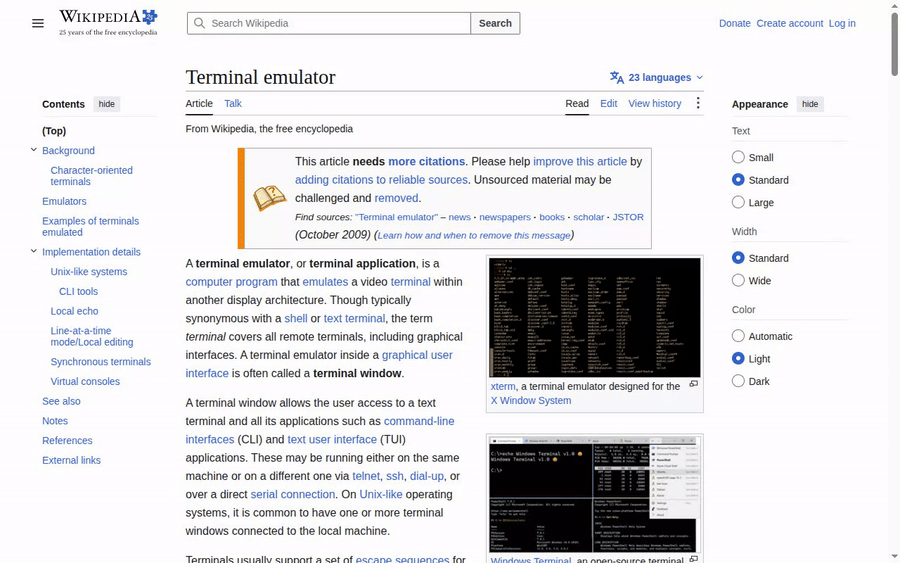
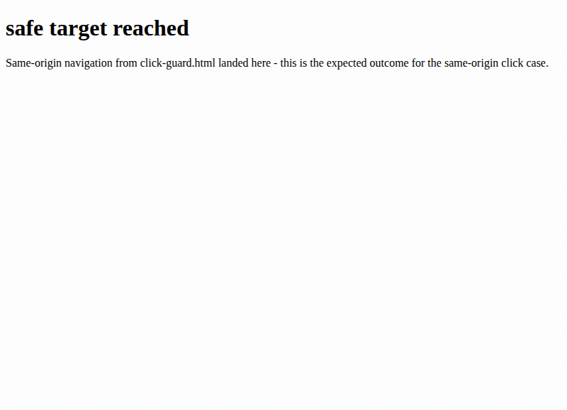
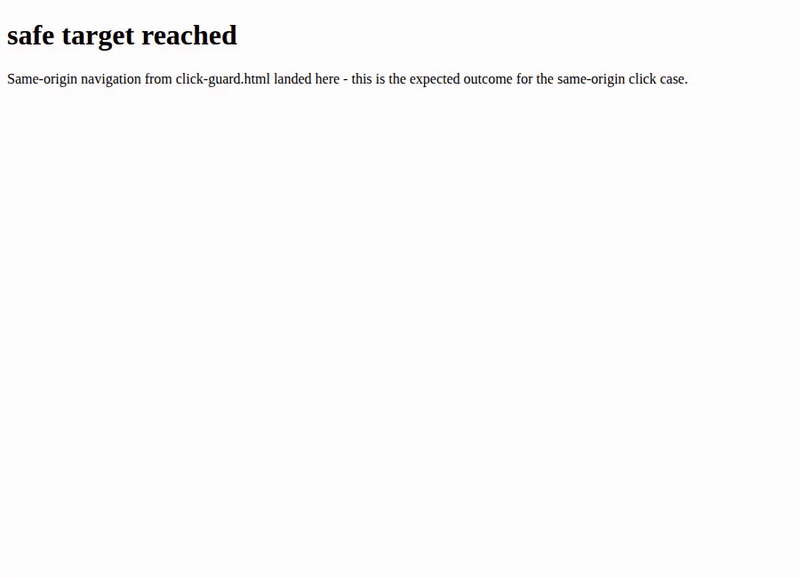

# lfl-terminal

A terminal overlay for any website. Press a hotkey, type a command. Known
commands run deterministically. Anything else is turned into **one**
proposed action by a **local** LLM - which you approve, exact and literal,
before it touches the page.

Nothing about the page you're on, or what you type, ever leaves your
machine.



New here? The one-page [cheat sheet](docs/CHEATSHEET.md) covers every command, scripts, and the teach lane.

*Deterministic commands driving a page, in the cursor-anchored floating panel - drag its title bar to move it, pin it to keep it put across opens. Model-proposed actions additionally require explicit approval.*

## It also plays snake

Alongside the deterministic commands above, the overlay ships a small fun
pack: `snake` and `2048`, rendered as plain text frames right in the
terminal panel; a few color `theme`s; `fortune`, `cowsay`; and a certain
steam locomotive for anyone who mistypes `ls`. None of it is the point of
the project, but it's here.

All of it runs entirely locally, never touches the page or the model, and
is covered by the exact same gates (fixed action vocabulary, egress lock,
rate limits) as everything else in this README - a game loop is not a
carve-out.





## Why

Most "AI browser agent" extensions ship your page content to a cloud model.
This one doesn't have a cloud model to ship it to: the only model it talks
to is a `llama.cpp`-class server on `127.0.0.1`, and the extension's service
worker is the only file allowed to make a network call at all - enforced by
a static test (`tests/check_no_egress.sh`), not just a design intention.

## What "local" and "supervised" actually mean here

Two words get thrown around a lot in this space, so here's what they mean
in this codebase, precisely, and no further:

- **Local** - your page content and your typed commands never leave the
  device. The extension has exactly one network call type: a loopback POST
  to `http://127.0.0.1:1238`. That's the only entry in `host_permissions`,
  and it's the only place `fetch`/`XMLHttpRequest`/`WebSocket`/etc. are
  allowed to appear in the codebase, checked by grep on every run.
- **Supervised** - no mutating action (`click`, `fill`, `select`,
  `navigate`) executes without you approving the *exact literal action*,
  rendered from the real page element, not from the model's own words about
  what it's about to do.

**What these do *not* mean: "safe," or "injection-proof."** A local model
can still be wrong. A page can still try to bias what it reasons toward.
Supervision means a human sees the specific thing before it happens - it
does not mean the system is immune to prompt injection, and this project
will never claim it is. The honest, detailed writeup of what's actually
guaranteed vs. what's a residual risk - including things found in
adversarial review and disclosed, not hidden - lives in
**[`docs/threat-model.md`](docs/threat-model.md)**. Reading that file before
trusting this on anything you care about is the whole point of writing it
publicly instead of burying it in a private doc. Transparency about limits
is a feature of this project, not an admission of failure.

## Status

**v0.5.x, experimental.** Chrome only for now (Manifest V3 - Firefox support
is on the roadmap). Requires a local `llama.cpp`-class server; the
deterministic commands (`search`, `open`, `go`, etc.) work even with the
model server offline, but anything routed to the LLM won't. CPU-only x86
inference will be slow for the LLM path - a few seconds per proposal is
normal; a GPU-backed server is much faster.

## Quickstart

**1. Start a local model server** on `127.0.0.1:1238` with a
Qwen3-4B-Instruct-class GGUF (Q5_K_M or better recommended).

Using the bundled dev script (reads `LLAMA_SERVER_DIR`/`LLAMA_MODEL_PATH`
from the environment or a gitignored `server/.env.local`):

```
export LLAMA_SERVER_DIR=/path/to/your/llama-server-dir
export LLAMA_MODEL_PATH=/path/to/Qwen3-4B-Instruct-2507-Q5_K_M.gguf
server/launch-dev.sh
```

Or run `llama-server` directly yourself:

```
llama-server --host 127.0.0.1 --port 1238 -m /path/to/model.gguf -c 4096
```

**2. Load the extension.** Open `chrome://extensions`, enable **Developer
mode**, click **Load unpacked**, select the `extension/` directory.

**3. Use it.** On any page, press `` ` `` (backtick, when focus isn't in a
page input) or `Ctrl+K` to open the overlay.

## Command reference

Deterministic commands never touch the model:

```
search "query" | search query   fill+submit the page search box
open <link text> | open <N>     navigate a same-origin link, by text or by an `ls` number
open!                           confirm the last cross-origin open
go <destination>                navigate anywhere (see below)
back                            browser back
scroll up | scroll down         scroll the page
extract links                   list visible links (text + href)
extract table                   dump the first table as aligned text
ls | ls links/buttons/fields    numbered listing of visible links/buttons/fields
click <N>                       click ls-listing item N - no approval card, same hard blocks
fill <N> with <text>            fill ls-listing field N, or by its label ("fill <label> with ...")
read                            extract the page's main readable content
find <text> | find              search visible page text; bare `find` goes to the next match
highlight <text> | highlight clear  mark every visible occurrence on the page (read-only visual layer, no page DOM changed); matches feed `find`
matches                         list all current highlight/find matches with context, numbered; step them with `find`
here                            compact orientation: counts, hints, suggested next commands
log                             this session's proposal/verdict audit log
budget                          remaining LLM-call / executed-action budget
continue                        resume after a rate-limit pause
alias <name> = <command>        define a single-command shortcut
unalias <name>                  remove an alias
macro <name> = <cmd1> && <cmd2> define a named && chain (depth-1)
unmacro <name>                  remove a macro
script new|ls|show|rm <name>    define/list/show/remove a named, multi-step script (v1)
run <name> [args...]            preview then run a script, substituting $1..$9/$@
teach <goal> [as <name>]        draft a script from a goal (opt-in, off by default - see below)
teach save that [as <name>]     draft a script from the most recently detected repeat pattern (needs memory on too)
teach on | teach off            enable/disable the brainstorm lane
memory | memory show            show what command-usage memory has recorded (opt-in, off by default)
memory on | memory off          enable/disable command-usage memory ("remember" also turns it on)
memory forget <site> | clear    erase one site's record, or wipe everything ("forget <site>" also works)
memory quiet | memory loud      silence or restore the "you do this a lot" nudge
origins                         origins visited by this tab this session
autoopen                        toggle auto-opening the terminal on this site (opt-in per origin, off by default)
dev on | dev off                toggle a test-only DOM hook (off by default)
help                            list commands
man <cmd>                       detailed usage for one command
clear                           clear the output pane
```

`cmd1 && cmd2 && ...` chains up to 5 commands, quote-aware - any error,
block, rejection, or Esc clears the rest of the chain.

As you type, a known command word lights up in the input line (and stays lit
in the echoed history) - that's lane feedback, not a security signal: lit
means this word dispatches deterministically, unlit means it becomes one
model proposal you still have to approve. The deterministic dispatch itself
never looks at the highlighter either way.

A **script** is a macro grown up: `script new checkout` opens a line-by-line
capture (blank line or Ctrl+Enter to save, Esc to cancel, up to 20 steps,
`#` comments allowed), then `run checkout "gift wrap"` substitutes `$1..$9`/
`$@` into the body, shows you the fully-resolved step list, and runs it after
one Enter. Scripts can only contain steps that are safe to replay later - a
step that addresses a page element by its `ls`-listing number (`click <N>`,
`fill <N> with ...`, `open <N>`, a bare number) is rejected when you try to
save it, because that number is only meaningful against one specific page
snapshot; a script uses `pause "<instruction>"` instead, which stops the run
and hands control back to you to do that one step by hand (`continue`
resumes). Every step's leading word must be a known command, a defined alias,
or `ask` (for an explicit model step); a freeform line like `book the flight`
is refused at save/import time, so a script only ever composes the fixed
vocabulary. Names are shared across aliases/macros/scripts - one name, one
thing - but a script's OWN name doesn't have to avoid built-in verbs, since
it's only ever reached via `run <name>`.

`teach` is opt-in and **off by default** - `teach on` turns it on for this
browser profile. Once on, `teach check the wunderground forecast for santa fe
as weather` sends only that typed goal text to your local model (no page
content of any kind, ever - same isolation guarantee as `go`'s nav-lane
above) and asks it to draft a script body using the same fixed vocabulary a
human would type by hand. The draft is validated through the exact same
`script new` path before you ever see an approval prompt - an invalid draft
(e.g. one that tries to address a page element by number) is shown with the
failing line and the reason, and nothing is saved; you re-run `teach` with a
clearer description or write it by hand instead. A valid draft is shown as
numbered steps with a save-or-discard approval card, same top-layer card as
everything else in this README; if you didn't give it a name with `as
<name>`, you're asked for one after approving. Once saved, a taught script is
an ordinary script - `run <name>` gives it the identical plan-preview and
per-step approval every hand-typed script gets. Drafting quality depends
entirely on the model behind your endpoint - measured on the open bench
(lfl-lab's brainstorm probe, whose default mode builds the request with this
extension's own payload code, so the numbers are about the exact bytes on
the wire): a 4B scored 20/20 valid drafts, a 35B 19/20, its one miss an
over-the-step-cap draft the validator rejected - exactly the designed
failure mode (see `docs/threat-model.md`'s M6 section for caveats). A
weaker model just means more drafts get rejected by the validator, never a
wider trust boundary, since the same fixed vocabulary and approval gate cover
every draft regardless of which model wrote it.

One phrasing tip that matters: name the destination explicitly. `teach go
to en.wikipedia.org, search for the eiffel tower, then open the eiffel
tower article` reliably gets a `go` step; `teach search wikipedia for the
eiffel tower` tends to read to a small model as "use the search box on
whatever page I'm on," and the draft will skip the navigation entirely.
The draft is always shown before you save, so a missing `go` step is
visible in the approval card - this tip just saves you a re-teach.

- The terminal can remember which commands you use where - `memory on` turns
  on a small, local, opt-in record of verbs and sites (e.g. `search` ran on
  `en.wikipedia.org` three times), so it can suggest turning a repeated
  pattern into a script. It never records arguments (what you searched for,
  typed, or filled in) or page content, and it's off by default - `memory
  show` proves exactly what's stored, `memory off` stops it.
- With BOTH `memory` and `teach` on, `teach` gives the local model a short
  trusted summary of your own command usage on the current site (verbs,
  counts, and the names of scripts you already have - never arguments, never
  page content) as background alongside your goal, so it can suggest a
  fitting script instead of a generic one. `teach save that` skips writing a
  goal entirely: it hands the model the most recently detected repeat
  pattern instead. This summary only ever goes to the same local model your
  own `teach` calls already use, and only when you invoke `teach` yourself -
  it is never sent anywhere else, and the page-driving model call (`ask` and
  everyday command resolution) never sees it at all. With memory off, `teach`
  behaves exactly as it always has.

A bare number by itself (after `ls`) does the sensible default thing for
that item: opens a link, clicks a button, or tells you how to fill a field.

`go <destination>` tries, in order: a literal URL/domain, a defined alias,
and only as a last resort, a second, narrower local-model call that sees
**only your typed text** (no page content at all) and proposes a
destination. A model-resolved destination always asks for confirmation,
every time - read it before approving.

Anything else, or an explicit `ask <...>`, goes to the local model as one
proposed action - unless what you typed looks like a typo of a known command
name, in which case you get a "did you mean" suggestion instead of spending
a model call on it (prefix with `ask` to force it to the model regardless).
`click`/`fill`/`select`/`navigate` proposed by the model render an approval
card you have to explicitly approve (Enter or click Approve) or reject (Esc
or click Reject); `answer`/`extract`/`scroll`/`abort` are read-only and
auto-run. The typed `click <N>`/`fill <N> with <text>` commands above skip
that approval card - they're direct, deterministic user intent, the same
way `search`/`open` always have been - but every hard block (credentials,
unsafe click targets) still applies exactly the same either way.

## Security model

- **Fixed, 8-primitive action vocabulary.** The model can only ever emit
  one of `click`, `fill`, `select`, `navigate`, `scroll`, `extract`,
  `answer`, `abort`, schema-constrained - never free-form code, never a
  multi-step plan.
- **Deterministic hard blocks the approval step cannot bypass.** Enforced
  in code, unconditionally: never fills/selects a password or OTP field;
  never clicks or navigates to a non-`http(s)` scheme or a cross-origin
  target (covers `href`, `formaction`, enclosing `<form action>`, `<area>`,
  and SVG `<a>`, re-resolved from the live DOM at execution time, not
  cached).
- **Three model lanes, never mixed.** The page-content lane (used for
  ordinary proposals) can never grant a cross-origin navigation - that's a
  hard block regardless of what the model outputs. The `go` command's
  nav-lane is the one thing that can navigate cross-origin, and it's
  reachable only from text you typed, never from page content or model
  reasoning about page content. The `teach` brainstorm lane is narrower
  still: its only output is a candidate script BODY - inert data, never
  executed by the lane itself - and it never sees page content either, only
  the goal text you typed.
- **Top-layer approval UI + occlusion re-check.** The approval card renders
  in the browser's top layer so page CSS/z-index can't cover or move it,
  and execution re-verifies the approve control is genuinely visible
  immediately before running - a detected occlusion aborts rather than
  proceeding.
- **Per-tab rate limits.** Deterministic caps on LLM calls and executed
  mutating actions per rolling window, visible via `budget`, persisted
  per-tab across navigation.

None of this adds up to a guarantee that the model can never be fooled into
proposing the wrong-but-technically-allowed action, or that every
navigation edge case is covered. **[`docs/threat-model.md`](docs/threat-model.md)**
is the honest, itemized account of what's covered, what isn't, and why -
read it, especially if you're evaluating this for anything beyond casual
use.

## Development

Ten Node unit-test suites (380 assertions total), no framework, no
`npm install`:

```
node tests/executor_credential.test.js
node tests/m2_security.test.js
node tests/funpack.test.js
node tests/sw_ratelimit_persistence.test.js
node tests/m3_nav_lane_isolation.test.js
node tests/m3_go_resolution.test.js
node tests/m3_chain_and_alias_macro.test.js
node tests/m3_hardening.test.js
node tests/m4_friction.test.js
node tests/m4b_games.test.js
```

Static grep gates:

```
bash tests/check_no_egress.sh   # network APIs appear only in the SW
bash tests/check_no_leaks.sh    # no dev-machine identity/infra strings
bash tests/check_no_emdash.sh   # no em dash (U+2014) in any tracked file
```

A Playwright battery also exists under `tests/` (`run_battery.py`,
`m2_adversarial.py`, `m3_battery.py`, and a small optional `m4_smoke.py` for
the M4a friction trio) for end-to-end/live-browser verification - it needs
`pip install playwright && playwright install chromium` (or another
Chrome-for-Testing build) and a running model server; see the scripts
themselves for details.

## License

Apache-2.0. No telemetry, no accounts, no network calls beyond the one
loopback LLM endpoint you point it at yourself.

## Roadmap

- Onboarding wizard
- Chrome built-in AI (Gemini Nano) as a zero-install tier
- Firefox support
